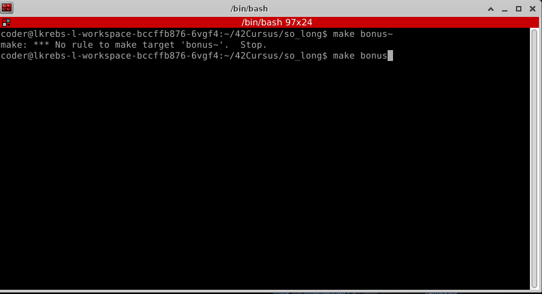

<div align="center">
	<div style="margin-bottom:3%">
		<a href="https://www.42sp.org.br/">
			
		</a>
	</div>
	<div>
		
		
		
	</div>
	<div>
		<a href="https://www.linkedin.com/in/lucas-l-a555bb199/">
			
		</a>
		<a href="https://github.com/KrebsCoder">
			
		</a>
	</div>
</div>


# so_long

This project is my first graphic project.
Using the X-Window API in C <a href="https://github.com/42Paris/minilibx-linux">Minilibx</a> I made a small 2D game and it was also my first game ever :smiley:.<br> I used my favorite cartoon when I was a kid as theme for the game. Hope you enjoy it!

---
# Dependencies

<a href="https://www.gnu.org/software/make/">Make</a><br>
<a href="https://gcc.gnu.org/">GCC</a><br>
<a href="https://github.com/42Paris/minilibx-linux">Minilibx</a><br>
<a href="https://git-scm.com/">Git</a>

---
# How to play so_long

- First thing you need to do is to clone this repository
```
git clone https://github.com/KrebsCoder/so_long.git
```

- After cloning you need to compile it. Entering the so_long directory, you'll need to type **make bonus**
```
make bonus
```

- After compiling it, you are going to be able to find an binary called so_long_bonus, you just need to execute it with a map

```
./so_long_bonus maps/map_bonus.ber
```

<div>
	
</div>

---
### Obs: I have created two maps, but you can also create your own maps

Rules that need to be followed in order to your new map be valid:

- The map must contain at least 1 exit, 1 collectible, and 1 starting position.
- The map must be rectangular.
-  The map must be closed/surrounded by walls.
- The map can be composed of only these 5 characters:
	- 0 for an empty space,
	- 1 for a wall,
	- C for a collectible,
	- E for a map exit,
	- P for the player’s starting position.


#### Example of valid map:


```
1111111111111
1001000000C01
1000011111001
1P0011E0000K1
1111111111111
```
